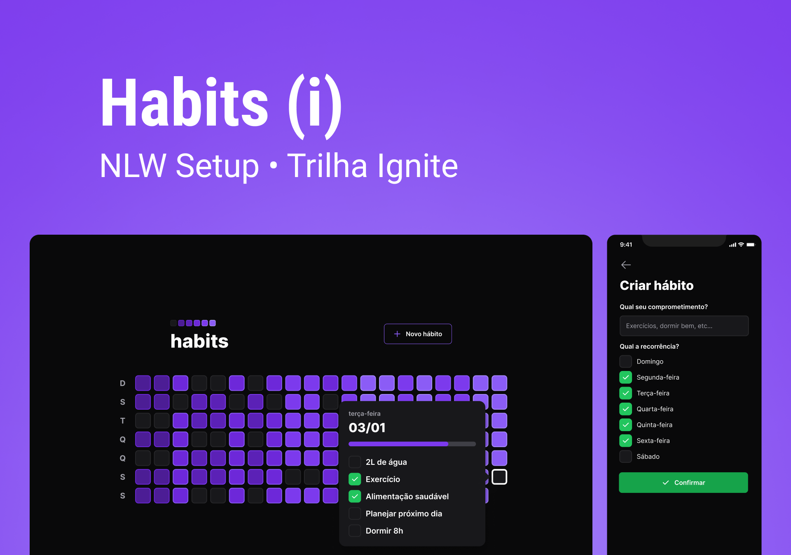

<h1 align="center">
  
</h1>

<br/>



<br/>

## 🚀 Próximo nível

- [ ] Autenticação
- [ ] Notificações
- [ ] Perfil público com resumo dos hábitos completados

<br/>

<br/>
## <a name='layout'></a> 🔖 Layout

Você pode visualizar o layout do projeto através do link abaixo:
- [Habits - Figma](https://www.figma.com/community/file/1195326661124171197)
Lembrando que você precisa ter uma conta para acessá-lo [Figma](http://figma.com/).
<br/>

## <a name='tecnologias'></a> 🛠️ Tecnologias
As seguintes ferramentas foram usadas na construção do projeto:
- [Node.js](https://nodejs.org/en/)
- [Fastify](https://www.fastify.io/)
- [Prisma](https://www.prisma.io/)
- [Vitejs](https://vitejs.dev/)
- [ReactJS](https://reactjs.org/)
- [TypeScript](https://www.typescriptlang.org/)
- [Tailwind CSS](https://tailwindcss.com/)
- [Expo](https://expo.io/)
- [React Native](https://reactnative.dev/)
- [NativeWind](https://www.nativewind.dev/)
<br/>

<br/>
## <a name='pre-requisitos'></a> 💻 Pré-requisitos
Antes de começar, você vai precisar ter instalado em sua máquina as seguintes ferramentas:
[Git](https://git-scm.com), [Node.js](https://nodejs.org/en/).
Além disto é bom ter um editor para trabalhar com o código como [VSCode](https://code.visualstudio.com/)
<br/>

## 🎲 Rodando o Back End (servidor)
<br/>
```bash
#Siga os passos abaixo
# Clone este repositório
$ git clone https://github.com/AndersonSilvaJob/NLW-Setup.git
# A partir da pasta raiz do projeto, vá para a pasta server
$ cd server
# Instale as dependências
$ npm i
# ou
$ yarn
# execute a aplicação
$ npm run dev
# ou
$ yarn dev
# Muito bem, o projeto vai ser iniciado em.
http://localhost:3333
```
<br/>

## 🖥️ Rodando o Front-End (web)
<br/>
_Obs.: Antes de continuar, certifique-se de ter a API em execução_
```bash
# A partir da pasta raiz do projeto, vá para a pasta web
$ cd web
# Instale as dependências
$ npm i
# ou
$ yarn
# execute a aplicação
$ npm run dev
# ou
$ yarn dev
# Muito bem, o projeto vai ser iniciado em.
http://localhost:5173
```
<br/>


## 📱 Mobile
<br/>
_Obs.: Antes de continuar, certifique-se de ter a API em execução_
```bash
# A partir da pasta raiz do projeto, vá para a pasta mobile
$ cd mobile
# Instale as dependências
$ npm i
# ou
$ yarn
# Iniciar o app
$ npm start
# ou
$ yarn start
# Se você vai emular com android, execute este comando
# Certifique-se de ter o emulador aberto
$ yarn android
# Se você for emular com ios, execute este comando
$ yarn ios
```
<br/>

<br/>
Anderson Silva ✌🏽 [Entre em contato ](https://www.linkedin.com/in/anderson-silva-a5b1b2206/)
